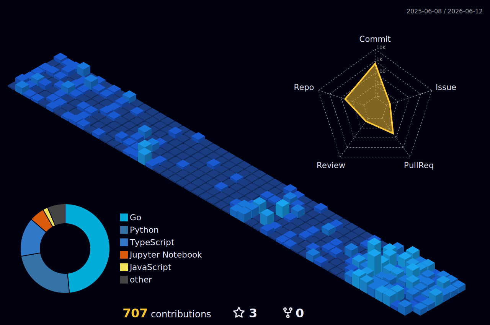

<h3 align="center">📊 My GitHub Activity</h3>

  

  

 

<h3 align="left">🚀 Languages & Systems</h3>

  

<h3 align="left">☁️ Backend, Cloud & DevOps</h3>

  

<h3 align="left">🧠 AI / ML / Data Science</h3>

  

<h3 align="left">📡 Observability & Cloud Native</h3>

  

<h3 align="left">🎨 Frontend & Visualization</h3>

  

<h3 align="left">🛠️ Tools & Workflow</h3>

  

 

<h3 align="center">🏅 My Holopin Badges</h3>

  

