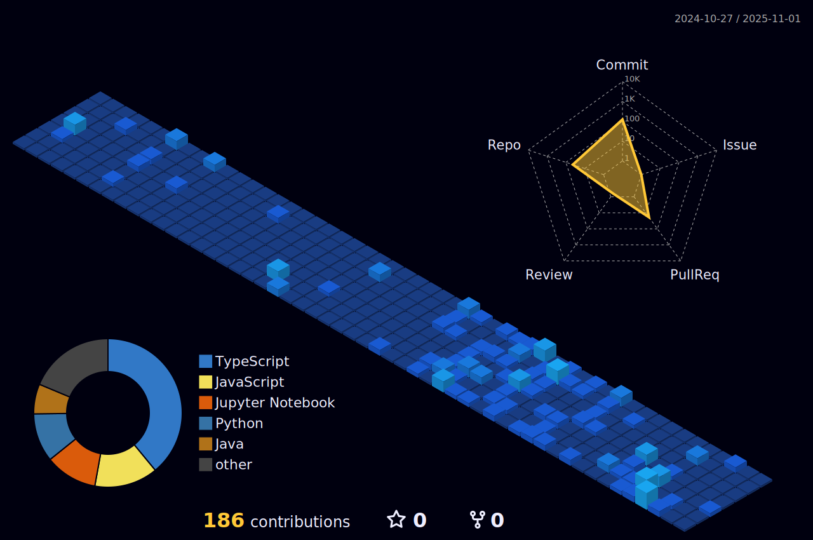

  
  <h1>
    Hi there, I'm Shreeharsh Shinde
  </h1>
  <h3>
    A Computer Science student and Open Source enthusiast.
  </h3>

---

### 🛠️ My Tech Stack

Here are some of the technologies I enjoy working with:

  
  
  
  
  
  
  

---

### 🌱 Open Source Contributions

I'm proud to be a contributor to `maplibre-gl-js`, a popular open-source library for interactive vector maps.

---

### 📊 My GitHub Activity

  

  
  

